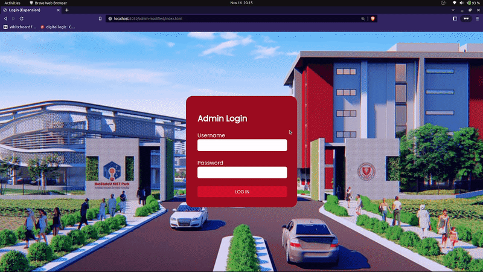

# Alumni web app

A simple alumni app project by team *magbabagsakanDito* that can be used as a future reference for the university's alumni web-app. This alumni app includes the client side (for the alumni) and administrators' that is made from bottom up.

Front-end repository can be seen [here](https://github.com/Sanjero20/alumni-app-ui). Older version and experiments on this repository can be seen [here](https://github.com/MrAgui/AlumniWeb). Mobile version of this project can be seen [here](https://github.com/gioshwua/AlmuniApp-Mobile).

### Admininistrator Sample

### Alumni Sample

 

# Setup for local environment
## Database Setup

For setting up your database, you can go to `alumni-app/database` folder and load the `revised_alumni_db.sql`. After loading, make sure to change the credential and database name values in `alumni-app/global_setup.php` properly connect to the database.

## Server setup

If using apache, all files on `alumni-app` folder can be simply pasted on `/var/www/html` folder.

If using php, simply start the server on alumni directory:

`~$ cd alumni`

`~$ php -S localhost:80`

and access the local web app on http://localhost/

 

# About us
## Developers

- [Aguilar, Karl](https://github.com/MrAgui)

- [Espinola I, Hubert](https://github.com/hubymeme22)

- [Reaño, Kenneth Joshua](https://github.com/gioshwua)

- [Santos, Angelo](https://github.com/Sanjero20)

## Designers

- Amatus, Angelika

- Cantos, Len Aubrey